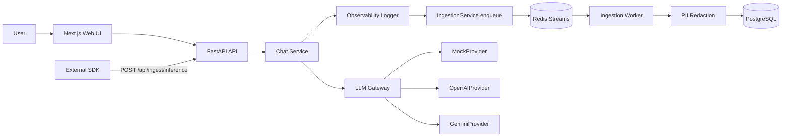

# InferLens

A production-style **LLM gateway and inference observability platform** for capturing, replaying, and comparing model traffic across providers.

> Most teams can get a chatbot working before they can explain what happened inside a single model call. InferLens closes that gap with a real request ledger: every inference is logged, traced, redacted, and replayable.

The chat UI exists to generate real traffic — the core system is the **gateway, ingestion pipeline, storage model, and operator views** behind it.

---

## Features

- **Provider-agnostic gateway** with `MockProvider`, `OpenAIProvider`, and `GeminiProvider`
- **Streaming chat** over `fetch()` + `ReadableStream`, with cancellation and resumable conversations
- **Redis Streams ingestion** with a background worker, retries, and dead-letter handling
- **Full trace detail** — spans, stream events, timings, errors, and redactions
- **Replay** any request from safe, stored snapshots (no secrets persisted)
- **Provider comparison** runs — one prompt, multiple targets, separate trace each
- **Dashboard** for latency, error/cancellation rate, tokens, cost, and provider usage
- **PII-aware persistence** — emails, phone numbers, keys, JWTs, and card patterns redacted from previews
- **Mock mode** — fully demoable with zero provider keys

**Out of scope:** prompt playground/versioning, dataset evals, LLM-as-judge, RAG, auth/RBAC, billing, Kubernetes, ClickHouse.

---

## Tech Stack

| Layer | Stack |
|---|---|
| **Frontend** | Next.js (App Router), TypeScript, Tailwind, Recharts |
| **Backend** | FastAPI, Pydantic, SQLAlchemy, Alembic, Uvicorn |
| **Data & Infra** | PostgreSQL, Redis Streams, Docker Compose |
| **Providers** | Mock, OpenAI, Gemini |

---

## Architecture

Three services run at runtime: `web` (Next.js UI), `api` (FastAPI gateway + query surface), and `worker` (Redis Streams consumer for observability persistence).



The API logs inference events internally and enqueues them to Redis. The worker normalizes and persists redacted records to PostgreSQL. Dashboard, logs, traces, replays, and comparisons all read back from Postgres.

---

## Quick Start

```bash
cp .env.example .env        # Windows: Copy-Item .env.example .env
docker compose up --build
```

Then open:

- **Web** → http://localhost:3000/chat
- **API health** → http://localhost:8000/health

`docker compose` starts `postgres`, `redis`, `api`, `worker`, and `web`. The API runs `alembic upgrade head` on startup before launching Uvicorn.

---

## Mock Mode

Mock mode is first-class — run the full pipeline (traces, logs, metrics, comparisons) with no real keys.

```env
LLM_MOCK_MODE=true
```

Simulate normal/streaming responses, timeouts, rate limits, provider errors, and cancellations using `mock-*` models.

**Demo flow:** send a prompt in `/chat` → open `/logs` → drill into a trace → run a replay → run a multi-target comparison in `/comparisons` → watch `/dashboard` update.

---

## Using Real Providers

```env
OPENAI_API_KEY=your-openai-key
GEMINI_API_KEY=your-gemini-key
LLM_MOCK_MODE=false
```

Keep keys only in your local `.env` — never commit them or paste them into prompts. Missing or invalid keys surface a normalized auth/config error instead of crashing, and provider URLs and sensitive query strings are stripped from logs and UI.

---

## API Surface

<details>
<summary><strong>Conversations & Chat</strong></summary>

```
POST   /api/conversations
GET    /api/conversations
GET    /api/conversations/{id}
DELETE /api/conversations/{id}
POST   /api/conversations/{id}/messages
POST   /api/conversations/{id}/messages/stream
POST   /api/conversations/{id}/cancel
POST   /api/conversations/cleanup-empty
```
</details>

<details>
<summary><strong>Observability — logs, dashboard, traces, replay</strong></summary>

```
GET  /api/logs
GET  /api/logs/{trace_id}
GET  /api/dashboard/summary | latency | errors | tokens | cost | providers
GET  /api/traces/{trace_id}
GET  /api/traces/{trace_id}/spans
GET  /api/traces/{trace_id}/replays
POST /api/traces/{trace_id}/replay
```
</details>

<details>
<summary><strong>Providers, ingestion & comparisons</strong></summary>

```
GET  /api/providers
GET  /api/providers/models
POST /api/ingest/inference
POST /api/comparisons
GET  /api/comparisons/{comparison_run_id}
```
</details>

---

## Data Model

PostgreSQL holds both product and observability data:

- **Conversation** — `conversations`, `messages`, `provider_configs`
- **Observability** — `inference_traces`, `inference_spans`, `inference_logs`, `stream_events`, `provider_errors`, `pii_redaction_events`
- **Reliability** — `ingestion_events` (idempotent by `event_id`), `dead_letter_events`
- **Comparison** — `comparison_runs`, `comparison_results`

UUID primary keys for core entities, JSONB for request snapshots and safe metadata, dedicated indexes for provider/model/status/timestamp queries, and redacted previews stored separately from canonical message content.

---

## Python SDK

A lightweight ingestion client lives at `packages/python-sdk/infersight_sdk`:

- `InferLensClient` (with `InferSightClient` retained as a backward-compatible alias)
- Sends events to `POST /api/ingest/inference`

---

## Development

```bash
# Backend tests
cd apps/api && python -m pytest

# Frontend build
corepack pnpm@9.12.3 --dir apps/web build
```

---

## Tradeoffs & Roadmap

Built to favor **clarity and demoability** over scale — Postgres over ClickHouse, Redis Streams over a heavier broker, lightweight provider adapters.

Next up: broader test coverage, log pagination + retention controls, longer-window dashboard aggregations, richer replay UI, scheduled archival, and a published, versioned SDK.
